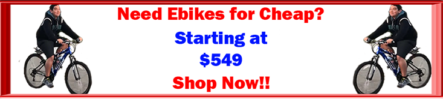

<!DOCTYPE html>
<html>
<head>
<meta name="description" content="The Home of the MAJic Ebike">

<title>
The MAJic Ebike | Home
</title>
<link rel="stylesheet" href="stickymenu.css" />
<link rel="stylesheet" href="stickymenumobile.css" />
<link rel="shortcut icon" href="images/favicon.ico" />

</head>
<body background="images/bg.png">

<button id="stickymobiletoggler"></button>

	

		<ul>
			<li></li>
			<li><a href="Tutorial.html">Tutorial</a></li>
			<li><a href="Video.html">Video</a></li>
			<li><a href="Gallery.html">Gallery</a></li>
			<li><a href="Awards.html">Awards</a></li>
			<li><a href="Buy_now.html">Buy Now</a></li>
			<li><a href="About_us.html">About Us</a></li>
		</ul>
	

 
 
<table cellspacing="10">
	<tr>
		<td width="50%">
			

				

			

		</td>
		<td width="50%">
		

			

				
					The
				
				
					 MAJic Ebike 
				
					was a science fair project by Abid Rasheed, Markus Zarco, and Joe Rosh.
					The problem was that e-bikes were becoming increasingly more expensive, costing around $1200 to get into the game.
				
			

			

				
					They aimed to change that.
				
			

		

		</td>
	</tr>
</tr>
 
</table>
 
 
 

<table width="50%">
	<td>
		

			

				
					The
				
				
					MAJic Ebike
				
				
					beat out the competition in the electric bike field by offering an extemely luctrative price for equal if not better performance.
				
			

		

	</td>
</table>

 
 
 

	<a href="Buy_now.html"</a>

 
 
 

	<small>
		
				Read our
		
		<a href="terms.html">TERMS AND CONDITIONS</a>
	</small>

</body>
</html>
